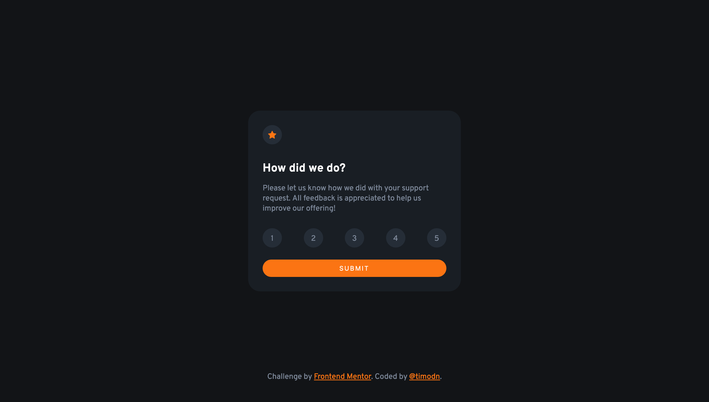

# Frontend Mentor - Interactive rating component solution

This is a solution to the [Interactive rating component challenge on Frontend Mentor](https://www.frontendmentor.io/challenges/interactive-rating-component-koxpeBUmI). Frontend Mentor challenges help you improve your coding skills by building realistic projects. 

## Table of contents

  - [The challenge](#the-challenge)
  - [Screenshot](#screenshot)
  - [Links](#links)
  - [Built with](#built-with)
  - [What I learned](#what-i-learned)
  - [Continued development](#continued-development)
  - [Author](#author)

### The challenge

Users should be able to:

- View the optimal layout for the app depending on their device's screen size
- See hover states for all interactive elements on the page
- Select and submit a number rating
- See the "Thank you" card state after submitting a rating

### Screenshot

### Links

- Solution URL: (https://github.com/TimmyOGH/Interactive-Rating-Component)
- Live Site URL: (https://your-live-site-url.com)

### Built with

- CSS custom properties
- Flexbox
- [React](https://reactjs.org/) - JS library

### What I learned

I learned to build a simple yet heuristic react app.

### Continued development

I'd love to build more react apps to hone my react skills.

## Author

- Frontend Mentor - [@timodn](https://www.frontendmentor.io/profile/timodn)
